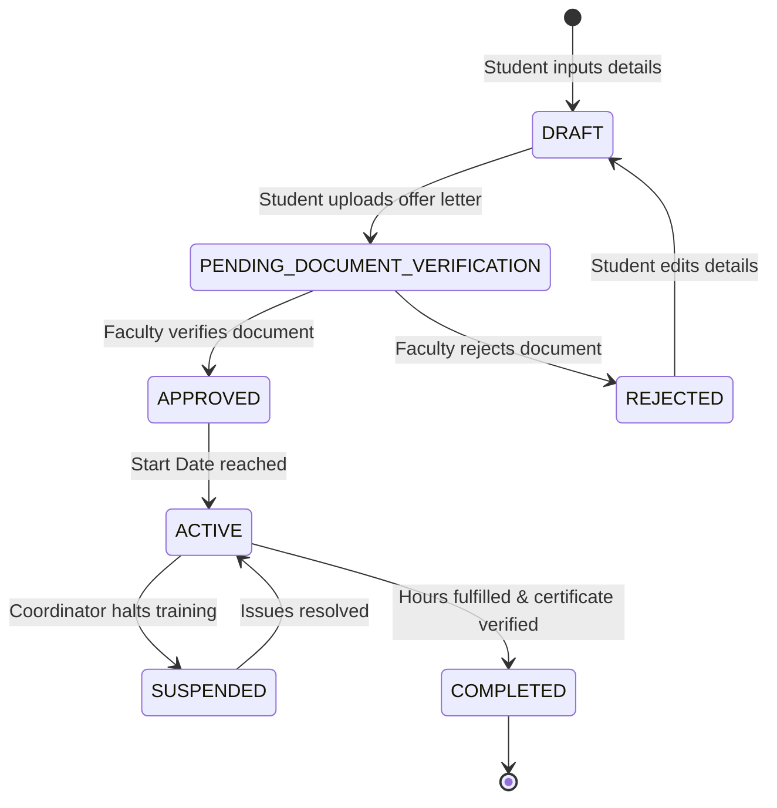
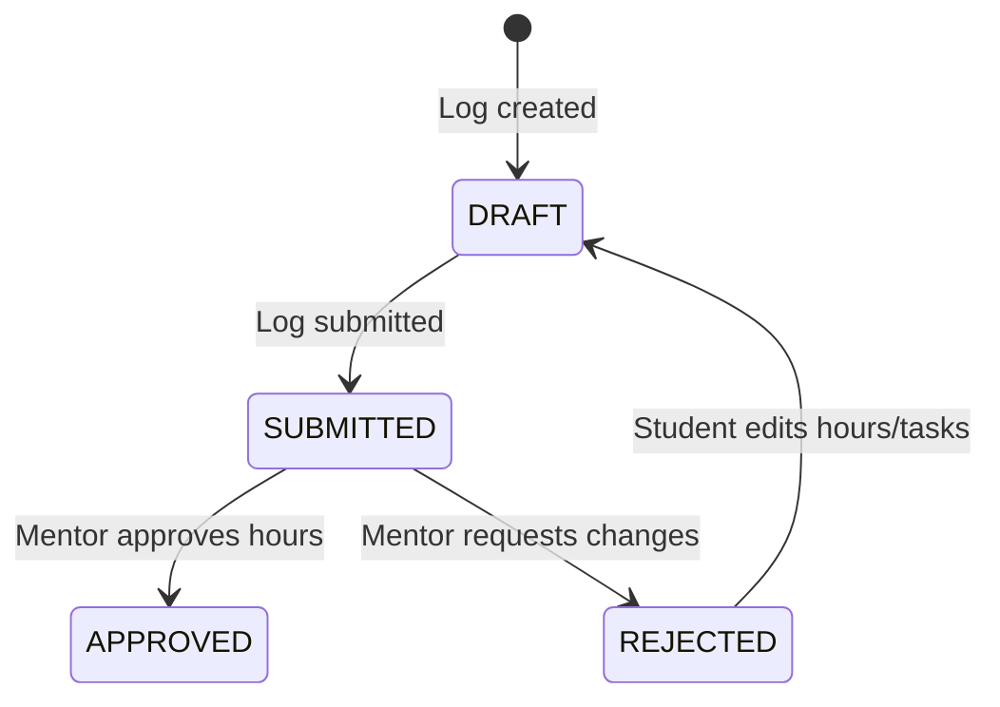
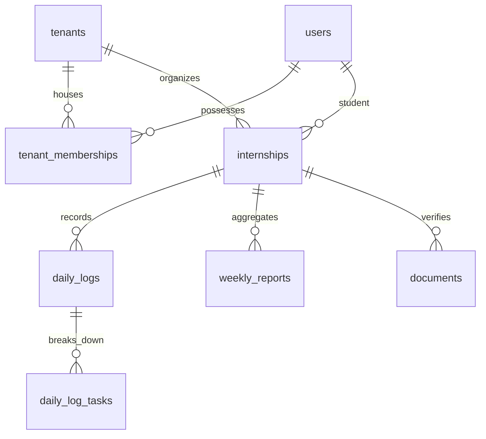

# InternSync Architecture Report & Target Database Design (Phase 1A)

This document outlines the technical design, relational database models, tenant isolation configurations, state machines, and migration strategies for transitioning the **OJT Tracker** into the multi-tenant **InternSync** product.

---

## 1. Executive Summary

The transition of the OJT Tracker to the SaaS platform **InternSync** requires refactoring from a single-college Document database (MongoDB) into a multi-college relational database (PostgreSQL/Supabase). To prevent regression, the stabilized MongoDB application was verified to compile, build, run, and pass tests successfully. 

During the audit, we clarified the routing structure:
- **`/api/training/progress`** is the active endpoint called by the frontend service to load the dashboard progress summary.
- **`/api/training/progress-summary`** does not exist. 
- Having one endpoint (`/api/training/progress`) mapped to the `getProgressSummary` controller prevents duplication.

Our recommended modernization path uses a Wadia-first, multi-tenant relational architecture powered by **Supabase PostgreSQL**. This document outlines the details of this design.

---

## 2. Database Decision Matrix

We evaluated three architectural database configurations:

| Evaluation Criteria | Option A: MongoDB (Mongoose) | Option B: PostgreSQL (Self-Hosted) | Option C: Supabase (Managed PostgreSQL) [RECOMMENDED] |
| --- | --- | --- | --- |
| **Multi-Tenancy** | Complex validation logic in app code. | Strict schema constraint via RLS. | Out-of-the-box RLS and tenant partitioning. |
| **Relational Data Integrity** | Manual application-level validation. | Strict database foreign key constraints. | Strict constraints + auto-generated APIs. |
| **Tenant Isolation** | Susceptible to code-level isolation bugs. | Robust row-level partition policies. | Industry-standard Row Level Security (RLS). |
| **Lifecycle Relationships** | Hard to enforce cascade state changes. | Transactional state machines. | Transactional state machines + functions. |
| **Reporting & Analytics** | Expensive aggregation pipelines. | Fast relational indexing and SQL queries. | Fast SQL queries and pre-built analytical views. |
| **Audit Logs** | Schema-less unstructured writes. | Structured logging tables. | Real-time database audit triggers. |
| **Document Storage** | GridFS or API wrapper required. | DB storage path reference only. | Native storage bucket with DB link and RLS. |
| **Development Complexity** | Low (current state). | Medium (requires schema migrations). | Low-Medium (SDK auto-generates API layers). |
| **Migration Complexity** | None. | High (MongoDB to SQL script). | High (MongoDB to Supabase migration script). |
| **Cost** | Low (Free tier Atlas). | Medium (Compute instances). | Free-to-Low (Supabase free tier/pay-as-you-grow). |
| **Maintainability** | Declines as relationships scale. | High. | Extremely High (managed services). |

### Recommendation Justification
**Option C (Supabase PostgreSQL)** is recommended. Its native support for **Row Level Security (RLS)** enforces tenant isolation at the database layer (preventing cross-tenant data leaks even in the event of API code bugs). Relational integrity guarantees that delete cascades and state constraints (e.g. daily logs linked to valid active internships) are enforced. Native integration with Supabase Auth and Storage simplifies secure file uploads for verification documents.

---

## 3. The Tenant Model

A **Tenant** represents an independent college or institution (e.g. *Nowrosjee Wadia College*). We compared two models:

1. **Option 1: Users with `tenant_id` (Direct Link)**
   - *Trade-off*: A user can belong to exactly one tenant. Simple to model, but breaks when external users (like Company Mentors or Faculty members working at multiple institutions) need multi-tenant access.
2. **Option 2: Users + `tenant_memberships` (Association Table) [RECOMMENDED]**
   - *Trade-off*: Decouples the authentication identity (`users`) from institutional authorization (`tenant_memberships`).
   - *Benefit*: A company mentor or external faculty member can link to multiple institutions using separate memberships while sharing a single authentication record.

```
[Users] 1 --- * [Tenant Memberships] * --- 1 [Tenants]
```

---

## 4. Authentication vs. Authorization

We define a clear separation of security boundaries:
- **Authentication**: Done globally at the platform level (via Supabase Auth).
- **Authorization**: Determined by active role associations inside the `tenant_memberships` table for a given `tenant_id`.
- **Tenant Access**: Enforced at the query level using `tenant_id` checks on the `tenant_memberships` table.
- **Resource Ownership**: Checked at the row level matching user identity (e.g. `student_id` matching authenticated `uid`).

### Role-Permission Matrix

| Resource | Action | Student | Company Mentor | Faculty Mentor | Tenant Admin |
| --- | --- | --- | --- | --- | --- |
| **Internship** | Read | Own record only | Assigned students | Assigned students | All in tenant |
| **Internship** | Write/Edit | Create Draft only | Update status | Update status | Fully manage |
| **Daily Log** | Create/Edit | Create/Edit (Draft) | No access | No access | No access |
| **Daily Log** | Approve | No access | Approve/Reject | View only | View only |
| **Weekly Report**| Submit | Submit own | View only | Approve/Reject | View only |
| **Documents** | Upload | Upload own | View only | Verify/Reject | View only |

---

## 5. Internship Lifecycle State Machine

The state machine for an Internship enrollment:



### Transition Specifications
1. **DRAFT → PENDING_VERIFICATION**: Triggered by Student upon uploading an offer letter.
2. **PENDING_VERIFICATION → APPROVED**: Triggered by Faculty Mentor after confirming company validity and letter authentication.
3. **ACTIVE → COMPLETED**: Auto-calculated when `completed_hours` matches or exceeds `total_hours` AND the completion certificate is verified by Faculty.

---

## 6. Daily Log Lifecycle



- **Data Integrity Constraints**:
  - Logs in `APPROVED` or `SUBMITTED` state cannot be edited or deleted by the student.
  - To edit an approved log, it must first be flagged for modification by a mentor (returning it to `DRAFT`).
  - Completed hours on `TrainingDetails`/`Internship` are recalculated dynamically using SQL sum triggers to prevent synchronization drift.

---

## 7. Weekly Report Lifecycle

1. **Generation**: Students generate a weekly report draft by aggregating logs from the week.
2. **AI Assistance**: The system calls Gemini API using a structured system prompt, sending the weekly logs' tasks as context to draft a formal summary.
3. **Review & Submit**: Student reviews the AI draft, modifies details, and submits the report.
4. **Faculty Review**: Faculty reads the report, adds remarks, and changes status to `APPROVED` or `REJECTED` (with resubmission allowed).

---

## 8. Complete Database Schema (PostgreSQL)

### Table: `tenants`
- **Purpose**: Independent institutions using the platform.
- **Columns**:
  - `id` UUID PRIMARY KEY DEFAULT gen_random_uuid()
  - `name` VARCHAR(255) NOT NULL
  - `domain` VARCHAR(255) UNIQUE
  - `created_at` TIMESTAMPTZ DEFAULT now()

### Table: `users`
- **Purpose**: Global user identities.
- **Columns**:
  - `id` UUID PRIMARY KEY REFERENCES auth.users(id) ON DELETE CASCADE
  - `first_name` VARCHAR(100) NOT NULL
  - `last_name` VARCHAR(100) NOT NULL
  - `email` VARCHAR(255) UNIQUE NOT NULL
  - `created_at` TIMESTAMPTZ DEFAULT now()

### Table: `tenant_memberships`
- **Purpose**: Institutional roles.
- **Columns**:
  - `id` UUID PRIMARY KEY DEFAULT gen_random_uuid()
  - `tenant_id` UUID REFERENCES tenants(id) ON DELETE CASCADE
  - `user_id` UUID REFERENCES users(id) ON DELETE CASCADE
  - `role` VARCHAR(50) CHECK (role IN ('STUDENT', 'COMPANY_MENTOR', 'FACULTY_MENTOR', 'ADMIN'))
  - `created_at` TIMESTAMPTZ DEFAULT now()
  - **Constraint**: UNIQUE(tenant_id, user_id, role)

### Table: `internships`
- **Purpose**: Tracks active internship details and required hours.
- **Columns**:
  - `id` UUID PRIMARY KEY DEFAULT gen_random_uuid()
  - `tenant_id` UUID REFERENCES tenants(id) ON DELETE CASCADE
  - `student_id` UUID REFERENCES users(id) ON DELETE CASCADE
  - `company_name` VARCHAR(255) NOT NULL
  - `job_role` VARCHAR(255) NOT NULL
  - `start_date` DATE NOT NULL
  - `end_date` DATE NOT NULL
  - `total_hours` INT CHECK (total_hours > 0)
  - `completed_hours` INT DEFAULT 0 CHECK (completed_hours >= 0)
  - `status` VARCHAR(50) DEFAULT 'DRAFT'
  - **Index**: `idx_internships_tenant` on `tenant_id`

### Table: `daily_logs`
- **Purpose**: Tracks student's daily logged hours.
- **Columns**:
  - `id` UUID PRIMARY KEY DEFAULT gen_random_uuid()
  - `tenant_id` UUID REFERENCES tenants(id) ON DELETE CASCADE
  - `internship_id` UUID REFERENCES internships(id) ON DELETE CASCADE
  - `date` DATE NOT NULL
  - `notes` TEXT
  - `status` VARCHAR(50) DEFAULT 'DRAFT'
  - `created_at` TIMESTAMPTZ DEFAULT now()
  - **Index**: `idx_daily_logs_internship` on `internship_id`

### Table: `daily_log_tasks`
- **Purpose**: Discrete tasks logged within a single day.
- **Columns**:
  - `id` UUID PRIMARY KEY DEFAULT gen_random_uuid()
  - `daily_log_id` UUID REFERENCES daily_logs(id) ON DELETE CASCADE
  - `description` TEXT NOT NULL
  - `hours` NUMERIC(4,2) CHECK (hours > 0)

### Table: `weekly_reports`
- **Purpose**: Synthesized weekly performance overview.
- **Columns**:
  - `id` UUID PRIMARY KEY DEFAULT gen_random_uuid()
  - `tenant_id` UUID REFERENCES tenants(id) ON DELETE CASCADE
  - `internship_id` UUID REFERENCES internships(id) ON DELETE CASCADE
  - `week_number` INT NOT NULL
  - `start_date` DATE NOT NULL
  - `end_date` DATE NOT NULL
  - `ai_summary` TEXT
  - `student_notes` TEXT
  - `status` VARCHAR(50) DEFAULT 'DRAFT'
  - `faculty_remarks` TEXT
  - `reviewed_by` UUID REFERENCES users(id)

### Table: `documents`
- **Purpose**: System verification documents (Offer letters/Certificates).
- **Columns**:
  - `id` UUID PRIMARY KEY DEFAULT gen_random_uuid()
  - `tenant_id` UUID REFERENCES tenants(id) ON DELETE CASCADE
  - `internship_id` UUID REFERENCES internships(id) ON DELETE CASCADE
  - `document_type` VARCHAR(50) CHECK (document_type IN ('OFFER_LETTER', 'COMPLETION_CERTIFICATE'))
  - `storage_path` VARCHAR(512) NOT NULL
  - `status` VARCHAR(50) DEFAULT 'PENDING'
  - `verified_by` UUID REFERENCES users(id)

---

## 9. ER Diagram



---

## 10. Tenant Isolation Strategy

Tenant separation is enforced at the database level using **PostgreSQL Row Level Security (RLS)**.

### RLS Policies (Examples)
```sql
-- Enable RLS on internships table
ALTER TABLE internships ENABLE ROW LEVEL SECURITY;

-- Student Policy: Read only own internships
CREATE POLICY student_select_policy ON internships
  FOR SELECT
  USING (
    student_id = auth.uid()
  );

-- Faculty Policy: Read all internships within tenant membership
CREATE POLICY faculty_select_policy ON internships
  FOR SELECT
  USING (
    tenant_id IN (
      SELECT tenant_id FROM tenant_memberships 
      WHERE user_id = auth.uid() AND role = 'FACULTY_MENTOR'
    )
  );
```

---

## 11. Company Mentor Cross-Tenant Strategy

To prevent company mentors from having access to a college's entire tenant database:
1. Company mentors are assigned specific student internships via an `internship_mentor_assignments` link table.
2. The RLS policy for company mentors checks this assignment table:
```sql
CREATE POLICY mentor_internship_policy ON internships
  FOR SELECT
  USING (
    id IN (
      SELECT internship_id FROM internship_mentor_assignments
      WHERE mentor_user_id = auth.uid()
    )
  );
```
This restricts company mentors' view exclusively to the specific student records they are assigned to supervise.

---

## 12. Document Storage Architecture

- **Bucket Strategy**: Separate private bucket `internsync-documents`.
- **Signed URLs**: The database stores relative storage paths (`/tenant_id/student_id/offer_letter.pdf`). The backend API issues time-limited signed read URLs (e.g. 15 minutes expiry) for file preview.
- **Upload Flow**: Upload request → API checks user state and yields a Supabase Storage pre-signed upload URL → Client uploads directly to bucket → File size and MIME type are validated at bucket boundary.

---

## 13. Audit Log Architecture

### Table: `audit_logs`
- `id` UUID PRIMARY KEY DEFAULT gen_random_uuid()
- `tenant_id` UUID REFERENCES tenants(id)
- `actor_id` UUID REFERENCES users(id)
- `action` VARCHAR(100) NOT NULL
- `target` VARCHAR(100) NOT NULL
- `before_state` JSONB
- `after_state` JSONB
- `timestamp` TIMESTAMPTZ DEFAULT now()

Triggers on tables `internships`, `daily_logs`, and `documents` will automatically insert rows into `audit_logs` to maintain a tamper-proof audit trail of state transitions.

---

## 14. MongoDB Migration Mapping & Strategy

### Collection to Table Mappings
1. **User (Mongoose)** → **users** (Auth) + **tenant_memberships** (Role mappings)
2. **TrainingDetails (Mongoose)** → **internships** (Status, dates, hours)
3. **DailyLog (Mongoose)** → **daily_logs** (Notes, dates) + **daily_log_tasks** (Split sub-tasks)

### Password & Authentication Transition
Since MongoDB passwords are encrypted with bcrypt, they can be migrated into Supabase's `auth.users` table using Supabase's custom password import scripts (which support bcrypt hash verification natively).

---

## 15. Architecture Decision Records (ADRs)

### ADR-001: Database Choice
- **Decision**: Migrate from MongoDB to Supabase PostgreSQL.
- **Reasoning**: Ensures multi-tenant isolation (via RLS), transactional lifecycles, and relational consistency.

### ADR-002: Multi-Tenant Strategy
- **Decision**: Logical isolation using tenant memberships and RLS policies on a shared single database instance.
- **Reasoning**: Maximizes resource efficiency while providing secure isolation.

### ADR-003: Authentication Strategy
- **Decision**: Supabase Auth (JWT).
- **Reasoning**: Provides pre-configured, secure OAuth, email verification, and integrated session management out of the box.

### ADR-004: Authorization Strategy
- **Decision**: Role-permission checks on association tables integrated with database-level RLS policies.
- **Reasoning**: Guarantees defense-in-depth protection.

### ADR-005: File Storage Strategy
- **Decision**: Private cloud storage buckets using signed access tokens.
- **Reasoning**: Keeps PII documents secure.

### ADR-006: AI Provider Abstraction
- **Decision**: Abstract wrapper class over Gemini API.
- **Reasoning**: Avoids vendor lock-in.

### ADR-007: PWA Strategy
- **Decision**: Standard web manifest + service worker.
- **Reasoning**: Native feel and caching support for student mobile log entry.

---

## 16. Risks and Tradeoffs
- **Migration Downtime**: Migrating schema structures from MongoDB to PostgreSQL requires a brief API freeze.
- **Offline Sync Risk**: Service worker sync of daily logs can result in clock conflicts if dates are not carefully managed on the client side.

---

## 17. Phase 1B Implementation Plan

1. **Step 1**: Provision Supabase instance and define schema tables, foreign keys, and indexes.
2. **Step 2**: Implement authentication migration scripts to load user records.
3. **Step 3**: Deploy database migrations for RLS policies.
4. **Step 4**: Refactor API routing files to query PostgreSQL instead of Mongoose.
